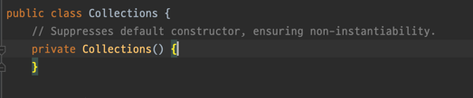

# 인스턴스화를 막으려거든 private 생성자를 사용하라

원저에서는 `Enforce noninstantiability with a private constructor`가 제목이다.

static 메서드와 static 필드를 모아둔 클래스를 만든 경우에, 해당 클래스를 `abstract`로 만들더라도 상속을 통해 인스턴스화가 가능하다.

아무런 생성자를 만들지 않은 경우, 컴파일러는 자동으로 `public` 기본 생성자를 만들어준다. 이 경우에도 인스턴스화가 가능하다.

명시적으로 private 생성자를 사용하면, 인스턴스화와 상속을 막을 수 있다.

생성자를 제공하지만 쓸 수 없기 때문에 직관에 어긋나는 점이 있는데, 그 때문에 주석을 추가하는 것이 좋다.

상속한 경우에 명시적이든 암묵적이든 상위 클래스의 생성자를 호출해야 하는데, 클래스의 생성자를 `private`선언한다면 호출이 막혔기 떄문에 상속을 할 수 없다.

> 유틸리티 클래스 예시 - java.lang.Math, java.util.Arrays, java.util.Collections
> 
> 
> 
> ~~주석이 조금 다른게 포인트~~

### 추가 고민해볼만한 내용

- 테스트는 어떻게 해야할까?

