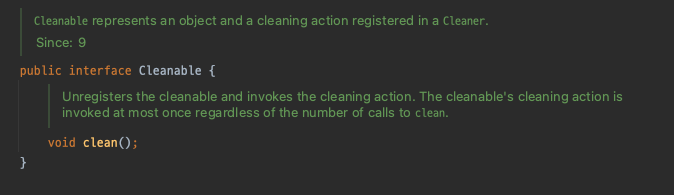

# 아이템 8 - finalizer와 cleaner 사용을 피하라

> ✱선 요약
> jdk8 이전 finalizer, 이후 cleaner는 자원의 close를 호출하지 않은 것에 대한 안전망 역할을 하거나 중요하지 않은 네이티브 자원 회수용으로만 사용하자.
> 하지만, 이 때도 불확실성과 성능 저하를 고려해야 한다.

## 정의

자바에 존재 했고, 존재 하는 객체 소멸자이다. `Object`의 `protected finalize()`메서드와 `java.lang.ref.Cleaner` 클래스를 의미한다.

간단하게 요약하자면, `gc`의 대상이 되게끔 만들어주는 녀석들이다.

## Finalizer

먼저 Finalizer에 대해 알아보자.
`Object`클래스의 `protected void finalize()`에는 왜 `Deprecated`됐는지 알 수 있다.

>❎ **Deprecated.**
>The finalization mechanism is inherently problematic. Finalization can lead to performance issues, deadlocks, and hangs. Errors in finalizers can lead to resource leaks; there is no way to cancel finalization if it is no longer necessary; and no ordering is specified among calls to `finalize` methods of different objects. Furthermore, there are no guarantees regarding the timing of finalization. The`finalize`method might be called on a finalizable object only after an indefinite delay, if at all. Classes whose instances hold non-heap resources should provide a method to enable explicit release of those resources, and they should also implement [`AutoCloseable`](https://docs.oracle.com/en/java/javase/17/docs/api/java.base/java/lang/AutoCloseable.html "interface in java.lang") if appropriate. The [`Cleaner`](https://docs.oracle.com/en/java/javase/17/docs/api/java.base/java/lang/ref/Cleaner.html "class in java.lang.ref") and [`PhantomReference`](https://docs.oracle.com/en/java/javase/17/docs/api/java.base/java/lang/ref/PhantomReference.html "class in java.lang.ref") provide more flexible and efficient ways to release resources when an object becomes unreachable.

이를 해석해 보자면, finalization 메커니즘은 성능 문제, 교착 상태 및 `hang`을 유발한다. `Finalizer`의 에러는 리소스 유출로 이어질 수 있다. `finalize`를 취소할 수 없고 또한 호출 순서 또한 보장할 수 없으며 최종적인 언제 실행 될지 보장할 수 없다고 한다. 따라서 `AutoCloseable`을 적절히 구현하거나 `Cleaner`를 사용하라는 내용이다. `Phantom Reference`는 [Java Phantom Reachable, Phantom Reference 란](https://luckydavekim.github.io/development/back-end/java/phantom-reference-in-java) 를 참고하자.

`GC`에 의해 개체에 대한 참조가 더 이상 없다고 판단할 때 호출 된다. `Object`의 하위 클래스들은 `finalize`메서드를 재정의 하여 언제 자원(resource)를 cleanup할지 정한다.

하위 클래스에서 `finalize()`를 오버라이드 할 때는 다음과 같이 하면 된다. 아래는 try-finally 구문을 이용하여 finalize 체인이 조기 종료 되는 exception을 방지하였다.

```java
     @Override
     protected void finalize() throws Throwable {
         try {
             ... // cleanup subclass state
         } finally {
             super.finalize();
         }
     }
```

## Cleaner

다음 차례는 Cleaner이다. Cleaner는 finalize와 다르게 클래스이다. 내부 인터페이스로 `Cleanable` 갖고 있다.



`Cleaner`클래스 api 레퍼런스의 내용을 살펴보면, `Cleaner`는 객체의 참조와 해당 cleaning 작업을 관리한다고 한다. `cleaner`는 객체가 `phantom reachable`상태가 된 것을 알림받게 되면, `cleaning actions`이 등록된다. `Cleaner`는  [reachability](https://docs.oracle.com/en/java/javase/17/docs/api/java.base/java/lang/ref/package-summary.html#reachability) 변화를 [`PhantomReference`](https://docs.oracle.com/en/java/javase/17/docs/api/java.base/java/lang/ref/PhantomReference.html "class in java.lang.ref") 과 [`ReferenceQueue`](https://docs.oracle.com/en/java/javase/17/docs/api/java.base/java/lang/ref/ReferenceQueue.html "class in java.lang.ref") 를 통하여 언제 호출될 지를 호출 받는다.

`finalize`와의 차이점은 `Cleaner`의 청소작업은 클리너와 연결된 스레드에 의해 수행된다는 점이다. 이 때 발생한 `exception`들은 모두 무시하고, `Cleaner`는 영향을 받지 않는다.

아래는 `AutoCloseable`을 구현한 Cleaning 예시 코드이다.

```java
 public class CleaningExample implements AutoCloseable {
        // 라이브러리는 Cleaner를 공유하는 것이 좋다.
        private static final Cleaner cleaner = <cleaner>;

        static class State implements Runnable {

            State(...) {
                // 초기화
            }

            public void run() {
                // State에 접근하는 cleanup action 위치. 최대 한번 실행된다.
            }
        }

        private final State state;
        private final Cleaner.Cleanable cleanable;

        public CleaningExample() {
            this.state = new State(...);
            this.cleanable = cleaner.register(this, state);
        }

        public void close() {
            cleanable.clean();
        }
    }
```

`static nested` 클래스로 선언 하는 것이 개체 참초가 유지되는 것을 막을 수 있다.

### 그외, 결론

>C++의 `destructor`와는 다르다.
>자바에서 접근할 수 없게 된 객체에 대해서 프로그래머는 아무런 작업도 하지 않아도 된다. 가비지 컬렉터가 이를 알아서 회수 하기 때문이다. 비 메모리 자원을 회수하는 경우, jdk7에서 소개된 try-with-resources와 try-finally를 이용하여 해결하면 된다.

사실 생소하지만서도 굳이 알 필요가 없는 느낌이긴하다.

`AutoCloseable`을 구현하고, 클라이언트에서는 인스턴스를 쓰고 난 다음 `close()`를 호출 해주면 된다. `Cleanner`를 사용할 땐 `try-with-resource`를 사용한다.
