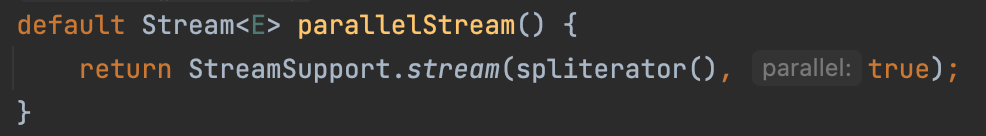
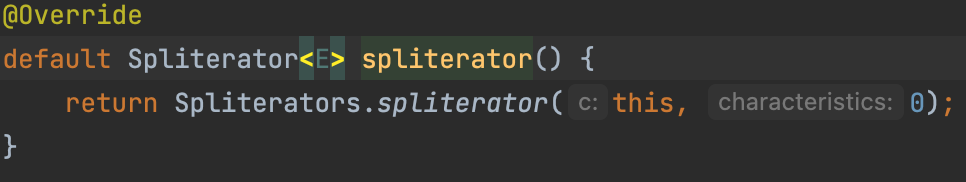

# 스트림 병렬화는 주의해서 적용하라

### 최 혁

---

## 병렬 스트림

__각각의 스레드에서 처리할 수 있도록 스트림 요소를 여러 청크로 분할한 스트림__

__병렬 스트림을 이용하면 모든 멀티코어 프로세서가 각각의 청크를 처리하도록 할당할 수 있다__

```java
arrayList.parallelStream().~~
Stream.iterate(1L, i -> i + 1)
    .parallel()
    .reduce(0L, Long::sum);
```

---

__순차 스트림을 통한 숫자의 합 계산__
```java
public long sequentialSum(long n) {
    return Stream.iterate(1L, i -> i + 1)
                .limit(n)
                .reduce(0L, Long::sum);
}
```
__병렬 스트림을 통한 숫자의 합 계산__
```java
public long parallelSum(long n) {
    return Stream.iterate(1L, i -> i + 1)
                .limit(n)
                .parallel()
                .reduce(0L, Long::sum);
}
```

---

## ForkJoin Framework(자바 7)

- __병렬화할 수 있는 작업을 재귀적으로 작은 작업으로 분할한 다음에 서브태스크 각각의 결과를 합쳐서 전체 결과를 만들도록 설계된 프레임워크__

- __ThreadPool을 생성하여 여러 작업을 병렬로 수행할 수 있다__

- __Task의 크기에 따라 분할(Fork)하고, 분할된 Task가 처리되면 그것을 합쳐(Join) 리턴하는 분할정복 알고리즘과 같이 동작한다__

- __RecursiveAction나 RecursiveTask의 서브클래스를 만들고, 추상 메서드인 compute에 분할 로직과 서브 태스크를 정의하는 것으로 구현 가능하다__

__병렬 스트림은 내부적으로 ForkJoinPool을 사용한다!__

---

## Spliterator Interface(자바 8)

- __Spliterator(분할할 수 있는 반복자)는 Iterator처럼 소스의 요소 탐색 기능을 제공하지만, 병렬 작업에 특화되어 있다__

```java
public interface Spliterator<T> {
    boolean tryAdvance(Custumer<? super T> action); //T 요소를 탐색하며 요소 유무 확인
    Spliterator<T> trySplit(); //요소를 분할하여 두 번째 Spliterator 생성
    long estimateSize(); //탐색해야 할 요소 수 예측
    int characterisics(); //Spliterator의 특성 표시
}
```
__trySplit이 null이 될 때까지 계속 재귀호출하며 탐색 후 실행한다__

---

## Collection의 parallelStream



__characteristics의 0은 ORDERED 특성으로 리스트처럼 요소에 정해진 순서가 있을 때 순서에 유의하라는 특성이다__

---

## 스트림 병렬화가 문제되는 상황

1. __공유된 상태를 바꾸는 알고리즘을 사용할 경우 : 안전 실패(safety failure)__
```java
public long sideEffectSum(long n) {
    List<Integer> list = Arrays.asList(1, 2, 3, 4);

    int result = LongStream.rangeClosed(1, n).reduce(5, Integer::sum);
    // result : 5 + 1 + 2 + 3 + 4 = 15

    result = LongStream.rangeClosed(1, n).parallel().reduce(5, Integer::sum);
    // result : (5+1) + (5+2) + (5+3) + (5+4) = 30
}
```

---

2. __한 스레드의 문제가 다른 스레드에게 전이되는 경우__
- 병렬 스트림 파이프라인은 같은 스레드 풀을 사용하므로 잘못된 파이프라인 하나가 시스템의 다른 부분의 성능에까지 악영향을 줄 수 있다

3. __실제 작업보다 병렬화에 드는 추가 비용이 더 클 때__
- 극단적으로, 데이터 소스 스트림이 효율적으로 나누어지고, 병렬화하거나 빨리 끝나는 종단 연산을 사용하고, 함수 객체들도 간섭하지 않더라도, 파이프라인이 수행하는 진짜 작업이 병렬화에 드는 추가 비용을 상쇄하지 못한다면 성능 향상은 미미하다. __(파이프라인이 수행하는 작업의 비용 < 병렬화에 드는 비용)__

---

4. __자동 박싱과 언박싱이 반복될 때(꼭 병렬이 아니더라도 유의)__
```java
public long parallelSum(long n) {
    return Stream.iterate(1L, i -> i + 1)
                .limit(n)
                .parallel()
                .reduce(0L, Long::sum);
}
```
반복 결과로 박싱된 객체가 만들어지므로 숫자를 더하려 하면 연산을 해야 된다

___

## 스트림 병렬화를 고려해야 할 경우

1. __스트림의 소스가 ArrayList, HashMap, HashSet, ConcurrentHashMap의 인스턴스거나 배열, int 범위, long 범위일 때__
- 데이터의 분할이 정확하고 쉽기에 일을 다수의 쓰레드에 분배하기 좋다
- 참조 지역성이 뛰어나다 (참조 지역성이 낮으면 캐시 실패 확률이 높아지고, 이에 따라 쓰레드가 낭비된다. 따라서 참조 지역성은 다량의 데이터를 처리하는 벌크 연산을 병렬화할 때 아주 중요한 요소로 작용한다. 참조 지역성이 가장 뛰어난 자료구조는 기본 타입의 배열이다)

---

2. __종단 연산이 병렬화에 적합할 때__

__종단 연산 중 축소(파이프라인에서 만들어진 모든 원소를 합치는 작업) 연산이 가장 병렬화에 적합하다__
ex) Stream의 reduce 메서드 중 하나, 혹은 min, max, count, sum 같이 완성된 형태로 제공되는 메서드 중 하나
anyMatch, allMatch, noneMatch처럼 조건에 맞으면 바로 반환되는 메서드

__가변 가변 축소(mutable reduction)를 수행하는 Stream의 collect 메서드는 병렬화에 적합하지 않다__
컬렉션을 합치는 부담이 크기 때문이다

---

## 결론

__계산도 올바르고, 성능도 빨라질거라는 확신 없이는 병렬화를 시도하지 말자. 만약 병렬화를 진행한다면 병렬화로 인한 문제점이 없는지 파악하고, 테스트 코드를 작성하여 성능을 검증하라__